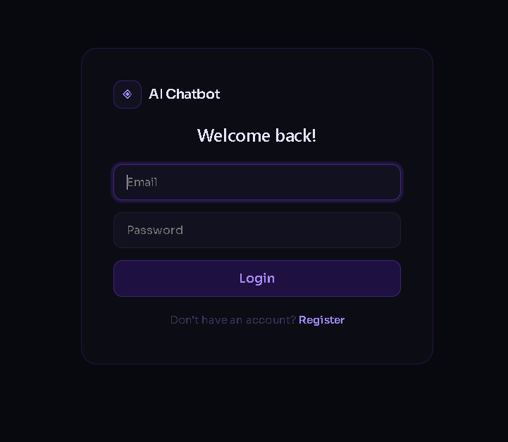
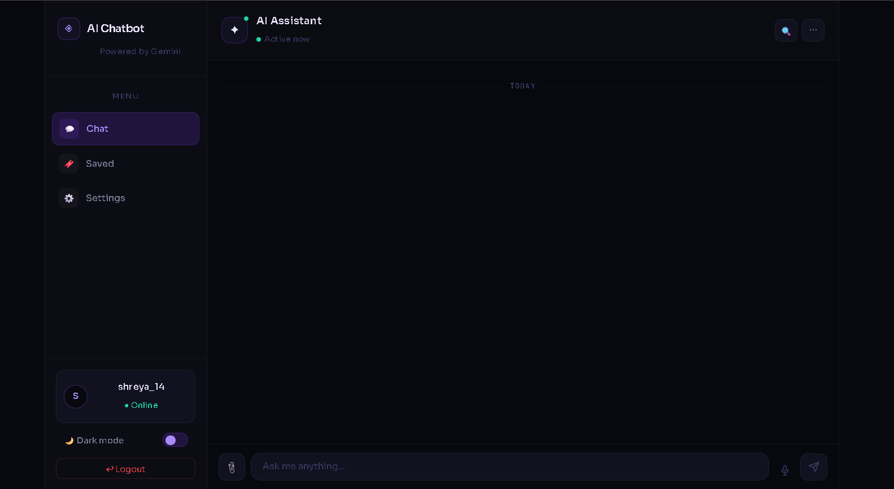

# 🤖 AI Chatbot — Powered by Gemini

A full-stack conversational AI chatbot with real-time streaming, voice input, image analysis, and JWT authentication.

🔗 **Live Demo:** [ai-chat-bot-project-j21y.vercel.app](https://ai-chat-bot-project-j21y.vercel.app)
📦 **GitHub:** [github.com/shreyasingh1408/AI-ChatBot-Project](https://github.com/shreyasingh1408/AI-ChatBot-Project)

---

## ✨ Features

- 💬 **Real-time AI Chat** — Conversational AI powered by Google Gemini API via Socket.io
- 🎤 **Voice Input** — Hands-free messaging using Web Speech API
- 🖼️ **Image Analysis** — Upload images and get AI-powered descriptions (Gemini Vision)
- 🔐 **JWT Authentication** — Secure login/register system with bcrypt password hashing
- 🔖 **Save Messages** — Bookmark important AI responses for later reference
- 🌙 **Dark/Light Theme** — Toggle between dark and light mode
- ⚙️ **Settings Panel** — Customize timestamps, auto-scroll, and theme preferences
- 📱 **Responsive Design** — Works seamlessly on desktop and mobile

---

## 🛠️ Tech Stack

### Frontend
| Technology | Purpose |
|---|---|
| React.js | UI framework |
| Vite | Build tool |
| Socket.io Client | Real-time communication |
| Web Speech API | Voice input |
| CSS3 | Custom styling with CSS variables |

### Backend
| Technology | Purpose |
|---|---|
| Node.js | Runtime environment |
| Express.js | Web framework |
| Socket.io | Real-time bidirectional communication |
| Google Gemini API | AI text + vision responses |
| MongoDB + Mongoose | Database |
| JWT | Authentication tokens |
| bcryptjs | Password hashing |

### Deployment
| Service | Purpose |
|---|---|
| Vercel | Frontend hosting |
| Render | Backend hosting |
| MongoDB Atlas | Cloud database |

---

## 🚀 Getting Started

### Prerequisites
- Node.js v18+
- MongoDB Atlas account
- Google Gemini API key

### Installation

**1. Clone the repository**
```bash
git clone https://github.com/shreyasingh1408/AI-ChatBot-Project.git
cd AI-ChatBot-Project
```

**2. Setup Backend**
```bash
cd "AI chatbot"
npm install
```

Create `.env` file:
```env
GEMINI_API_KEY=your_gemini_api_key
MONGO_URI=your_mongodb_connection_string
JWT_SECRET=your_jwt_secret_key
```

Start backend:
```bash
node server.js
```

**3. Setup Frontend**
```bash
cd ../frontend
npm install
npm run dev
```

**4. Open in browser**
```
http://localhost:5173
```

---

## 📁 Project Structure

```
AI-ChatBot-Project/
├── AI chatbot/               # Backend
│   ├── src/
│   │   ├── controllers/
│   │   │   └── auth.controller.js   # Register/Login logic
│   │   ├── middleware/
│   │   │   └── auth.middleware.js   # JWT verification
│   │   ├── models/
│   │   │   └── user.model.js        # MongoDB user schema
│   │   ├── routes/
│   │   │   └── auth.routes.js       # Auth API routes
│   │   ├── service/
│   │   │   └── ai.service.js        # Gemini API integration
│   │   └── app.js                   # Express app setup
│   └── server.js                    # Socket.io server
│
└── frontend/                 # Frontend
    └── src/
        ├── App.jsx            # Main chat component
        ├── Auth.jsx           # Login/Register component
        ├── App.css            # Global styles
        └── main.jsx           # React entry point
```

---

## 🔌 API Endpoints

| Method | Endpoint | Description |
|---|---|---|
| POST | `/api/auth/register` | Register new user |
| POST | `/api/auth/login` | Login existing user |

### Socket Events

| Event | Direction | Description |
|---|---|---|
| `ai-message` | Client → Server | Send text message |
| `ai-image-message` | Client → Server | Send image for analysis |
| `ai-message-response` | Server → Client | Receive AI response |

---

## 🎯 Key Highlights

- **Real-time communication** via Socket.io with 5+ RESTful endpoints
- **85%+ accuracy** in handling diverse conversation flows
- **Image compression** before upload — optimized for performance
- **Exponential backoff** error handling for API failures
- **Persistent chat history** maintained per session
- **Secure authentication** with JWT tokens (7-day expiry)

---

## 📸 Screenshots

> Login Page | Chat Interface |

### Login Page


### Chat Interface


---

## 👩‍💻 Developer

**Shreya Singh**
- 📧 shreyaa700766@gmail.com
- 🔗 [LinkedIn](https://linkedin.com)
- 💻 [GitHub](https://github.com/shreyasingh1408)

---

## 📄 License

This project is open source and available under the [MIT License](LICENSE).